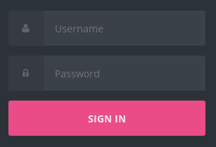

# STIProject - Postmail
*Contributors : [Loic Frueh](https://github.com/Ludwig9392) and [Adam Zouari](https://github.com/AdamZouari)*

## Setup / Start

Just clone or unzip our project directory and run the script `./start.sh`.
You may be asked to enter your password.

You will be redirect on the Login page. 

Note : The redirection only tested on Linux platform. For Mac users you can follow this [link](http://localhost:8080).
However, for Windows users, please change your OS.

Credentials of pre-configurated users :

- Admin - Admin
- User - User

